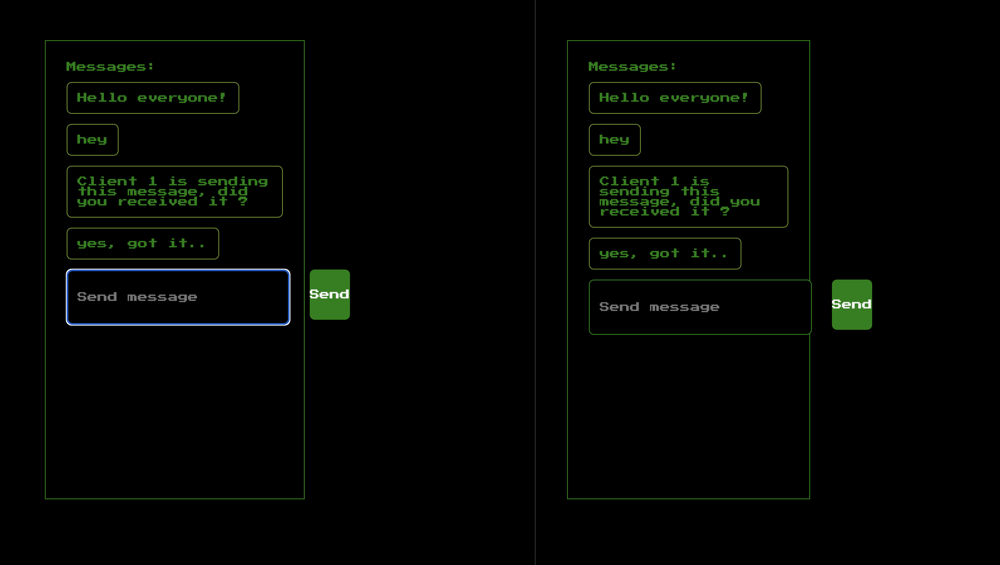

### Real time chat application

This application let you to connect and chat multiple user is real time with being page refresh.

### Installation

* Clone the repository into your local and run command 'npm install' in root of your project.
* Set the PORT in .env file and run 'npm start'.

### Screenshots

